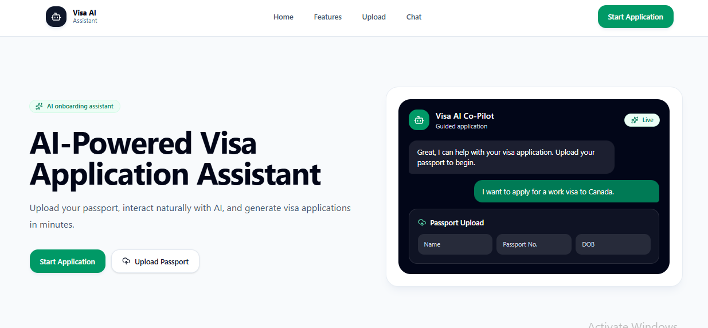
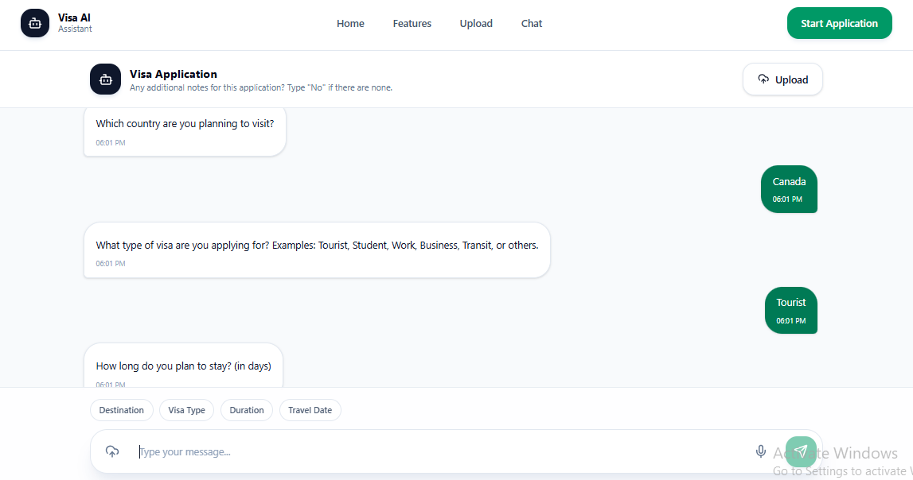
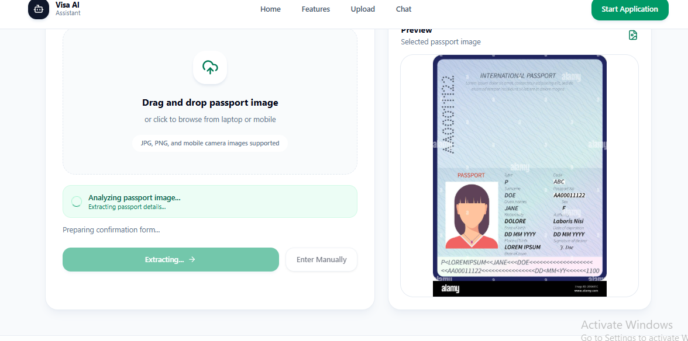
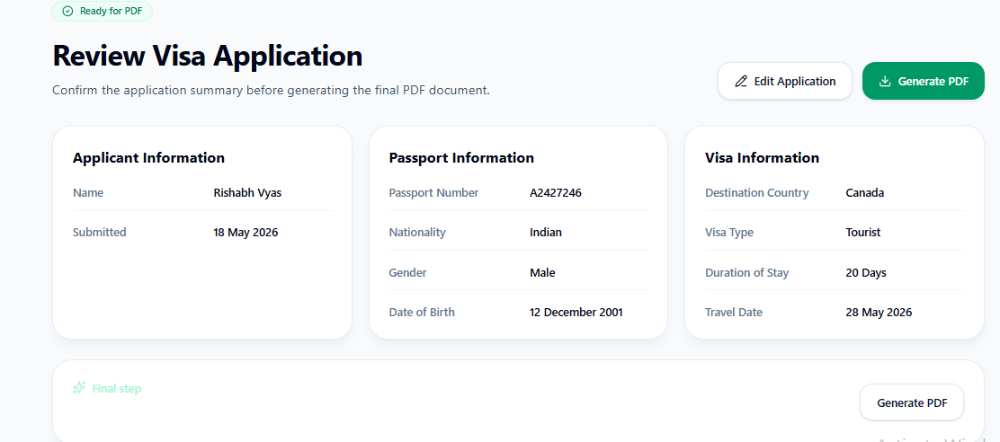

# AI-Based Visa Form Assistant

An AI-powered visa application assistant that helps users complete visa forms through an interactive conversational workflow. The system supports passport OCR extraction, MRZ-based passport parsing, guided chat-based data collection, smart validation, PDF generation, and application storage.

---

# Live Demo

https://visa-form-mu.vercel.app/

---

# Features

## AI-Assisted Conversational Workflow
- Interactive chat-based visa application flow
- Step-by-step guided data collection
- Smooth multi-step conversational experience
- Editable visa application workflow
- Session persistence using sessionStorage
- Dynamic validation during conversations

---

## Passport OCR Extraction
- Upload passport images
- Automatic passport detail extraction
- MRZ-first passport parsing pipeline
- OCR cleanup and normalization
- ICAO-compliant passport support

### Extracted Fields
- Full Name
- Passport Number
- Nationality
- Issuing Country
- Sex
- Date of Birth
- Expiry Date

The system uses OCR.space API along with MRZ parsing to improve extraction reliability and reduce incorrect OCR-based parsing.

---

## Smart Validation System
The application validates:
- Country names
- Nationalities
- Passport number format
- Gender selection
- Valid dates
- Travel duration
- Required fields

Invalid or incomplete inputs are rejected during the conversational workflow.

---

## Professional PDF Generation
- Clean administrative PDF export
- Professional visa application summary
- Structured formatting and sections
- Application metadata support
- Footer and submission details

---

## Review & Edit Workflow
- Review all entered information before submission
- Manual correction support for visa fields
- Locked passport identity fields after verification
- Prevent incomplete application generation
- Controlled workflow progression

---

## Responsive UI
- Mobile responsive layout
- Smooth conversational chat interface
- Modern clean design
- Sticky chat interaction flow
- Responsive review and upload pages

---

# Tech Stack

## Frontend
- React.js
- React Router
- Tailwind CSS
- Framer Motion
- Axios
- Lucide React

---

## Backend
- Node.js
- Express.js
- PDFKit
- Multer

---

## Database
- MongoDB
- Mongoose

---

## OCR / AI
- OCR.space API
- MRZ-based passport extraction
- Gemini 2.5 Flash
- Conversational workflow handling

---

# Project Structure

```bash
VisaForm/
│
├── client/
│   ├── src/
│   │   ├── components/
│   │   ├── pages/
│   │   ├── utils/
│   │   ├── routes/
│   │   └── assets/
│
├── server/
│   ├── routes/
│   ├── models/
│   ├── middleware/
│   ├── utils/
│   └── uploads/
│
├── README.md
└── package.json
```

---

# Core Workflow

## 1. Start Application
User opens the assistant and starts the visa application workflow.

---

## 2. Upload Passport
User uploads a passport image through the application.

---

## 3. OCR + MRZ Extraction
The system extracts passport details automatically using OCR and MRZ parsing.

---

## 4. User Validation
User reviews and confirms extracted passport details before continuing.

---

## 5. Conversational Form Filling
The assistant collects visa-related information such as:
- Destination country
- Visa type
- Duration
- Travel date
- Additional notes

---

## 6. Review Application
User reviews all entered information before final submission.

---

## 7. Generate PDF
A professional visa application PDF is generated automatically.

---

## 8. Store Application
The completed application is stored in MongoDB.

---

# Validation Logic

The system validates:
- Country names
- Nationalities
- Passport formats
- Gender selection
- Travel duration
- Valid dates
- Required fields

The conversational workflow prevents invalid or incomplete submissions in real time.

---

# PDF Generation

Generated PDF includes:
- Application Header
- Application ID
- Submission Date
- Applicant Information
- Passport Information
- Visa Information
- Additional Notes
- Professional Footer

The generated PDF is designed to simulate a realistic visa application summary document.

---

# Supported Passport Types

The system is optimized for:
- ICAO-compliant machine-readable passports
- Standard international passport formats
- Passports with clearly visible MRZ zones

Supported across multiple countries and tested on various international passport layouts.

---

# Known Limitations

Performance may reduce for:
- Blurry images
- Cropped passports
- Low-light images
- Rotated images
- Fake/sample/generated passports
- Non-ICAO passport layouts
- Images without visible MRZ sections

The system is optimized for real-world machine-readable passport formats.

---

# Screenshots

## Landing Page



---

## Chat Assistant



---

## Passport OCR Upload



---

## Review Application



---

# Installation

## Clone Repository

```bash
git clone https://github.com/devR1shabh/VisaForm.git
```

---

## Frontend Setup

```bash
cd client
npm install
npm run dev
```

---

## Backend Setup

```bash
cd server
npm install
npm start
```

---

# Environment Variables

Create a `.env` file inside `server/`

```env
PORT=5000
DATABASE_URL=your_mongodb_connection_string

OCR_SPACE_API_KEY=your_ocr_space_api_key
GEMINI_API_KEY=your_gemini_api_key
```

---

# Future Improvements

- Multi-language support
- Passport image preprocessing
- OCR confidence scoring
- Visa eligibility prediction
- Email notifications
- Cloud storage integration
- AI travel recommendations

---

# Key Highlights

- OCR + MRZ-based passport extraction
- AI-assisted conversational visa workflow
- Smart validation architecture
- Professional PDF generation
- MERN stack implementation
- Responsive user interface
- Real-world workflow simulation

---

# Author

Rishabh Vyas  
Full Stack Developer

## Connect With Me

- LinkedIn: https://linkedin.com/in/rishabhvyas-dev
- GitHub: https://github.com/devR1shabh
- Email: rishavvyas74@gmail.com

---

# License

This project is built for educational, demonstration, and portfolio purposes.